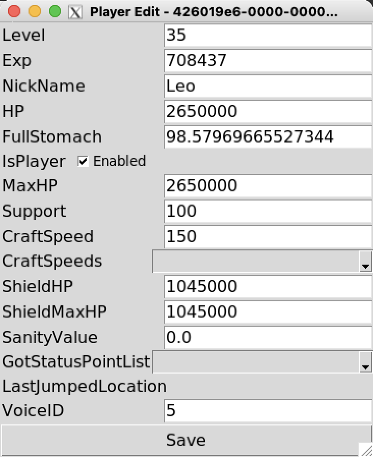

# palworld-server-toolkit

### Tools for Palworld servers
The world fastest PalWorld server save editor, parse Level.sav in 1.1s for JSON about 1.5GB, and for convert.py time spent in 1m40s.

<p align="center">
   <a href="/README.md">简体中文</a> | <strong>English</strong>
</p>


<p align='center'>
&nbsp;&nbsp;
&nbsp;&nbsp;
</p>


### GUI




### Install

1. Python 3.9 or newer.
    - Windows users: You can install [Python 3.12 from the Microsoft Store](https://apps.microsoft.com/detail/9NCVDN91XZQP) or from [python.org](https://www.python.org/)

2. Install `pip` Package manager
	- For Linux users: `python -m ensurepip --upgrade`
	- For Windows users: `py -m ensurepip --upgrade`

3. Use pip to install `pip install palworld-server-toolkit` or `python -m pip install palworld-server-toolkit`

### Source Code Prerequisites

1. Python 3.9 or newer.
    - Windows users: You can install [Python 3.12 from the Microsoft Store](https://apps.microsoft.com/detail/9NCVDN91XZQP) or from [python.org](https://www.python.org/)

2. Use `pip install palworld-save-tools` or `git submodule update --init --recursive` or Download [https://github.com/cheahjs/palworld-save-tools](https://github.com/cheahjs/palworld-save-tools) and put `palworld-save-tools` contents to `save_tools` directory

3. Windows User present use `Windows Terminal` instance of `cmd` for color

### Question?

[Discord](https://discord.com/channels/1200798336916144188/1200803146407096341)


---

## palworld-player-list
```
usage: palworld-playey-list [-h] [--host HOST] [--port PORT] [--password PASSWORD] [filename]

List player on the Players Folder

positional arguments:
  filename              Filename of the player sav

options:
  -h, --help            show this help message and exit
  --host HOST, -H HOST  Host for PalWorld Server RCON
  --port PORT, -P PORT  PalWorld Server RCON Port
  --password PASSWORD, -p PASSWORD
                        RCON Password
```

- List player - `python3 list.py` in working directory `/PalSaved/SaveGames/0/<server id>/Players`
- Check player detail - `python3 list.py <PLAYER HEX UID>`


---

## palworld-save-editor

This tools is for cleanup the unreference item, rename the player name, migrate player and delete the player.

> [!CAUTION]
> 
> :warning: This tool is experimental. Be careful of data loss and *always* make a backup.


> [!NOTE]
> 
> Without -o params, default save file is `Level_fixed.sav`
> 
> Use source code version just replace below command ` -m palworld_server_toolkit.editor` to `palworld_server_toolkit/editor.py`

- For cleaning the capture log in guild, use the follow command `python -m palworld_server_toolkit.editor --fix-missing --fix-capture Level.sav`

- For GUI to modify `Level.sav` file - `python -i -m palworld_server_toolkit.editor -g -o Level.sav Level.sav`

- For modifiy the `Level.sav` file, use the follow command
`python -i -m palworld_server_toolkit.editor -o Level.sav Level.sav`

	- `ShowPlayers()` - List the Players
	- `FixMissing()` - Remove missing player instance
	- `FixCaptureLog()` - Remove invalid caputre log in guild
	- `FixDuplicateUser()` - Remove duplicated user data
	- `ShowGuild()` - List the Guild and members
	- `BindGuildInstanceId(uid,instance_id)` - Update Guild binding instance for user
	- `RenamePlayer(uid,new_name)` - Rename player to new_name
	- `DeletePlayer(uid,InstanceId=None, dry_run=False)` - Wipe player data from save InstanceId: delete specified InstanceId
	- `EditPlayer(uid)` - Allocate player base meta data to variable `player`
	- `MoveToGuild(uid,guild_id)` - Move player to guild `guild_id`
	- `OpenBackup(filename)` - Open Backup Level.sav file and assign to `backup_wsd`
	- `MigratePlayer(old_uid,new_uid)` - Migrate the player from old PlayerUId to new PlayerUId
	- `CopyPlayer(old_uid,new_uid, backup_wsd)` - Copy the player from old PlayerUId to new PlayerUId `backup_wsd` is the OpenBackup file, `wsd` is current file
	- `Save()` - Save the file and exit


### Function screenshot


### Operate Sample

> [!IMPORTANT]
> 
> ALL OPERATE REQUIRE to STOP SERVER
> 
> Finally is replace `Level_fixed.sav` to `Level.sav` and start Palworld Server.


- Migrate difference server to single server sample:

	1. Copy old server `Level.sav` to `SaveGames/0/<Server ID>/Old-Level.sav`
	2. Copy old server `Players/xxxxxxxx000000000000000000000000.sav` to `SaveGames/0/<Server ID>/Players/xxxxxxxx000000000000000000000000.sav`
	3. Use interactive mode `python -i -m palworld_server_toolkit.editor Level.sav`
	4. Execute following command and run `CopyPlayer` for each migrate player
		> :warning: UUID can be the same, the user data will be copy from `backup_wsd`
		```
		OpenBackup("Old-Level.sav")
		CopyPlayer("xxxxxxxx-0000-0000-0000-000000000000", "xxxxxxxx-0000-0000-0000-000000000000", backup_wsd)
		Save()
		```
	5. \(Optional) remove all the old `xxxxxxxx000000000000000000000000.sav` and `Old-Level.sav`

- Migrate Local save to server:

	1. Copy local save `Level.sav` to `SaveGames/0/<Server ID>/Old-Level.sav`
	> For co-op saves, they are usually at
	`C:\Users\<username>\AppData\Local\Pal\Saved\SaveGames\<SteamID>\<World Folder>`

	1. Copy local `Players/00000000000000000000000000000001.sav` to `SaveGames/0/<Server ID>/Players/00000000000000000000000000000001.sav`
	1. Use interactive mode `python -i -m palworld_server_toolkit.editor Level.sav`
	1. Execute following command 
		```
		OpenBackup("Old-Level.sav")
		CopyPlayer("00000000-0000-0000-0000-000000000001", "xxxxxxxx-0000-0000-0000-000000000000", backup_wsd)
		Save()
		```
	5. remove `00000000000000000000000000000001.sav` and `Old-Level.sav`

- Migrate User

	1. Use interactive mode `python -i -m palworld_server_toolkit.editor Level.sav`
	1. Execute following command 
		```
		MigratePlayer("xxxxxxxx-0000-0000-0000-000000000000","yyyyyyyy-0000-0000-0000-000000000000")
		Save()
		```


---

## palworld-server-taskset
Tools for set cpu affinity to CPU performance core (Linux only)

---

## Acknowledgements

- [palworld-save-tools](https://github.com/cheahjs/palworld-save-tools) for providing save file parsing tool implementation
