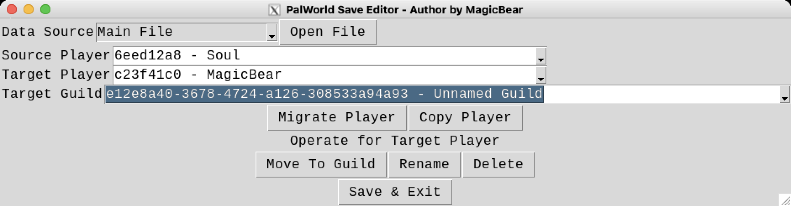
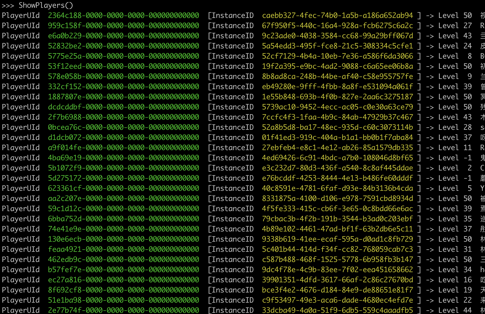
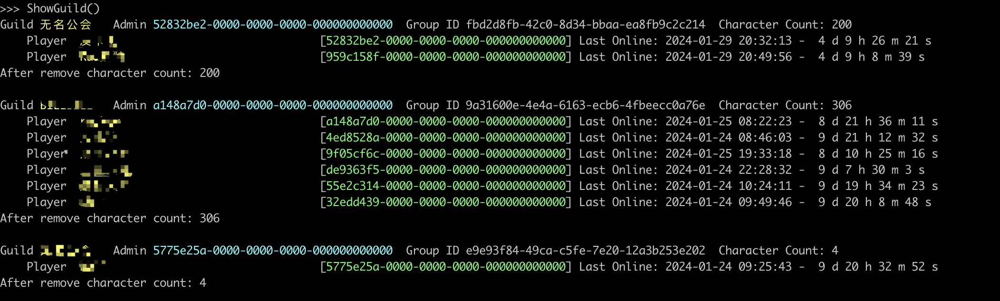

# Palworld Server Toolkit

### 幻兽帕鲁服务端工具包

<p align="center">
   <strong>简体中文</strong> | <a href="/README.en.md">English</a>
</p>

<p align='center'>
&nbsp;&nbsp;
&nbsp;&nbsp;
</p>

世界上最高速的帕鲁服务器存档编辑器, 1.1秒打开对应转换时间1分40秒的约1.5GB的JSON。

- 这个工具包可用于在 Palworld 世界间转移角色，允许朋友们将他们的角色转移到彼此的服务器上，而不会失去任何进度。

- 亦可以用于编辑玩家所持有的帕鲁、参数、持有物品、金钱等等数据。

- 亦可以移动玩家的公会、删除营地、删除玩家


---

- [Palworld Server Toolkit](#palworld-server-toolkit)
  - [如何安装](#直接运行)
  - [找到存档文件](#faq)
  - [操作示例](#操作示例)
  - [感谢](#感谢)


## GUI



## 直接运行

访问 [Release Pages](https://github.com/magicbear/palworld-server-toolkit/releases) 下载运行即可。

## 手动安装

1. Python 3.9或以上版本.
    - Windows用户: 可从 [Microsoft Store下载Python 3.12](https://apps.microsoft.com/detail/9NCVDN91XZQP) or [python.org](https://www.python.org/)

2. 安装 `pip` 包管理器
	- For Linux users: `python -m ensurepip --upgrade`
	- For Windows users: `py -m ensurepip --upgrade`

3. 使用 `pip install palworld-server-toolkit` 安装

## 使用源码前置安装需求

1. Python 3.9或以上版本.
    - Windows用户: 可从 [Microsoft Store下载Python 3.12](https://apps.microsoft.com/detail/9NCVDN91XZQP) or [python.org](https://www.python.org/)

2. 使用 `pip install palworld-save-tools` or `git submodule update --init --recursive` 或 下载 [https://github.com/cheahjs/palworld-save-tools](https://github.com/cheahjs/palworld-save-tools) 并放置 `palworld-save-tools` 内容至 `save_tools` 目录下

3. Windows 用户建议使用 `Windows Terminal` 取代 `cmd`，否则不显示色彩

## 问题交流

QQ群 139107098

---
## palworld-player-list
```
usage: palworld-playey-list [-h] [--host HOST] [--port PORT] [--password PASSWORD] [filename]

用于列出服务器Players目录中的玩家名字，PlayerUId，Steam ID

positional arguments:
  filename              Filename of the player sav

options:
  -h, --help            show this help message and exit
  --host HOST, -H HOST  Host for PalWorld Server RCON
  --port PORT, -P PORT  PalWorld Server RCON Port
  --password PASSWORD, -p PASSWORD  RCON密码
```


- 列出玩家 - 在工作目录 `/PalSaved/SaveGames/0/<server id>/Players` 中运行 `python3 list.py`
- 玩家详细 - `python3 list.py <PLAYER HEX UID>`

---
## palworld-save-editor

清理捕捉日志，改名，合并不同服务器玩家，删除玩家，迁移坏档等工具包

> [!CAUTION]
> 
> :warning: 此工具是实验性的。 小心数据丢失并 ***务必*** 进行备份。


> [!NOTE]
> 
> 未加-o参数默认保存文件为`Level_fixed.sav`
>
> 使用源码版本 以下命令 ` -m palworld_server_toolkit.editor` 部份 修改为 `palworld_server_toolkit/editor.py` 运行即可


- 清理捕捉日志及不存在玩家数据 - `python -m palworld_server_toolkit.editor --fix-missing --fix-capture Level.sav`

- 使用GUI修改 `Level.sav` 文件 - `python -i -m palworld_server_toolkit.editor -g -o Level.sav Level.sav`

- 修改 `Level.sav` 文件 - `python -m palworld_server_toolkit.editor -i -o Level.sav Level.sav`

	- `ShowPlayers()` - 列出玩家
	- `FixMissing()` - 删除未引用玩家数据
	- `FixCaptureLog()` - 删除多余捕捉日志
	- `FixDuplicateUser()` - 删除多余用户数据
	- `ShowGuild()` - 列出公会及成员列表
	- `BindGuildInstanceId(uid,instance_id)` - 修改公会成员绑定ID
	- `RenamePlayer(uid,new_name)` - 修改玩家名字为 `new_name`
	- `DeletePlayer(uid,InstanceId=None, dry_run=False)` - 删除玩家数据 `InstanceId: 删除指定InstanceId`
	- `DeleteGuild(group_id)` - 删除公会
	- `DeleteBaseCamp(base_id)` - 删除基地
	- `EditPlayer(uid)` - 快速指定玩家数据至变量`player`
	- `MoveToGuild(uid,guild_id)` - 移动玩家至公会`guild_id`
	- `OpenBackup(filename)` - 打开备份`Level.sav`文件并指向变量`backup_wsd`
	- `MigratePlayer(old_uid,new_uid)` - 从`old_uid`向`new_uid`迁移玩家数据
	- `CopyPlayer(old_uid,new_uid, backup_wsd)` - 复制玩家数据 `backup_wsd` 为OpenBackup备份文件 `wsd`为当前主文件
	- `Save()` - 保存修改并退出

### 功能截图




### 操作示例
> [!IMPORTANT]
> 
> 以下操作均需先退出服务端
> 
> 最后均为把 `Level_fixed.sav` 替换至 `Level.sav` 并启动服务端

- 跨服务器迁移玩家数据示例

	1. 复制旧服务器 `Level.sav` 至 `SaveGames/0/<Server ID>/Old-Level.sav`
	1. 复制旧服务器所有需迁移玩家 `Players/xxxxxxxx000000000000000000000000.sav` 至 `SaveGames/0/<Server ID>/Players/xxxxxxxx000000000000000000000000.sav`
	1. 使用编辑模式运行 `python -i -m palworld_server_toolkit.editor Level.sav`
	1. 使用以下命令 并所有需迁移玩家执行`CopyPlayer`
		> :warning: UUID 可相同，数据自`backup_wsd`拷贝
		```
		OpenBackup("Old-Level.sav")
		CopyPlayer("xxxxxxxx-0000-0000-0000-000000000000", "xxxxxxxx-0000-0000-0000-000000000000", backup_wsd)
		Save()
		```
	5. \(Optional) 最后删除旧 `xxxxxxxx000000000000000000000001.sav`, 

- 本地存档迁移至服务器示例

	1. 复制本地 `Level.sav` 至 `SaveGames/0/<Server ID>/Old-Level.sav`
	> 本地存档通常在
	`C:\Users\<username>\AppData\Local\Pal\Saved\SaveGames\<SteamID>\<World Folder>`

	2. 复制本地 `Players/00000000000000000000000000000001.sav` 至 `SaveGames/0/<Server ID>/Players/00000000000000000000000000000001.sav`
	3. 使用编辑模式运行 `python -i -m palworld_server_toolkit.editor Level.sav`
	4. 使用以下命令
		```
		OpenBackup("Old-Level.sav")
		CopyPlayer("00000000-0000-0000-0000-000000000001", "xxxxxxxx-0000-0000-0000-000000000000", backup_wsd)
		Save()
		```
	5. \(Optional) 最后删除旧 `00000000000000000000000000000001.sav` 和 `Old-Level.sav`

- 迁移用户示例

	1. 使用编辑模式运行 `python -i -m palworld_server_toolkit.editor Level.sav`
	2. 使用以下命令 
		```
		MigratePlayer("xxxxxxxx-0000-0000-0000-000000000000","yyyyyyyy-0000-0000-0000-000000000000")
		Save()
		```


---

## palworld-server-taskset

把服务端绑定至CPU性能核 (Linux only)

---

# FAQ

- 复制玩家为将角色及其所有队伍和终端中的伙伴、角色身上的物品以及进度转移，但不会转移任何地图对象、原世界中箱子里的物品以及基地中工作的伙伴。（如果你想将它们一起转移，请将它们移动到身上/终端中）
- 对于合作模式的存档，存档文件通常位于 `C:\Users¥<用户名>\AppData\Local\Pal\Saved\SaveGames<SteamID><世界文件夹>`
- 对于Xbox Game Pass玩家的存档，存档文件通常位于 `C:\Users\<用户名>\AppData\Packages\ PocketpairInc.Palworld_ad4psfrxyesvt\SystemAppData\wgs`
- 对于服务器存档，请通过 Steam 进入服务器的文件位置。
- 你需要至少 3 个文件来完成转移：源玩家角色存档文件（在 Players/中），源世界的 level.sav 文件，以及目标世界的 Level.sav 文件
- 对于本地合作模式的存档，如果你是主机，角色文件始终是 `000000...001.sav`
- 对于其他玩家的存档，只需知道他们的 `ID` 在不同世界间不会改变，因此他们在你的合作世界和服务器世界的角色文件名是相同的。

- 存档结构如下
	- 源世界
	```
	SaveGames
	└── <steam-id>
	    └── <source-world-id>
	        ├── backup
	        ├── Level.sav  ----------  <- The source world save-file
	        ├── LevelMeta.sav
	        ├── Players
	        │   ├── 00000...0001.sav
	        │   └── 12345...6789.sav   <- character save-file we want to transfer
	        └── WorldOption.sav
	```
	- 目标世界
	```
	SaveGames
	└── <steam-id>
	    └── <destination-world-id>
	        ├── backup
	        ├── Level.sav  ----------  <- The target world save-file
	        ├── LevelMeta.sav
	        ├── Players
	        │   ├── 00000...0001.sav   <- the target player-placeholder save-file
	        │   └── 98765...4321.sav
	        └── WorldOption.sav
	```

---

# 感谢

- [palworld-save-tools](https://github.com/cheahjs/palworld-save-tools) 提供了存档解析工具实现
- [PalEdit](https://github.com/EternalWraith/PalEdit) - 提供了帕鲁编辑器
- [PalworldCharacterTransfer](https://github.com/jmkl009/PalworldCharacterTransfer) - 参考了其中的动态物品数据迁移引用概念
